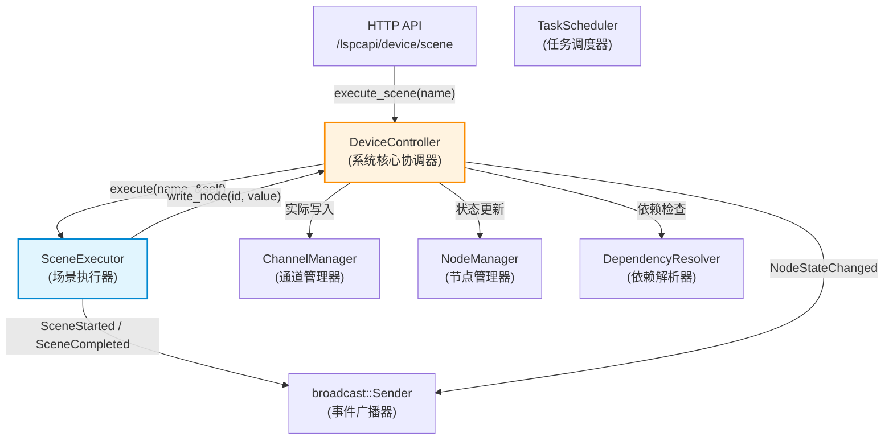
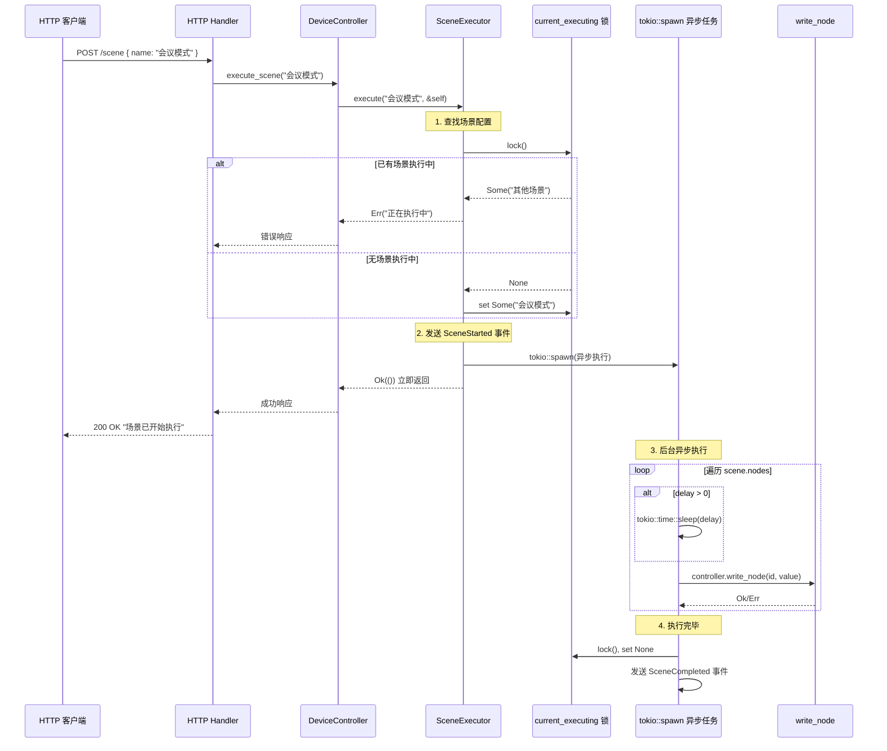

# 场景执行器 (SceneExecutor) 详解

## 概述

场景执行器 (`SceneExecutor`) 是 DM-Rust 设备管理系统中的**场景编排引擎**。它负责将用户预定义的"场景"（一组设备操作的集合）按照配置的顺序和延迟依次执行，实现"一键控制多个设备"的效果。

**典型应用场景：**
- "会议模式"：调暗灯光 → 延迟 500ms → 开启投影机 → 延迟 1000ms → 降下投影幕布 → 打开功放
- "关闭全部"：同时关闭所有灯光、投影机、音频设备、空调

---

## 架构位置

场景执行器在系统中的层级关系如下：



### 核心组件关系

| 组件 | 职责 | 与 SceneExecutor 的关系 |
|------|------|-------------------------|
| `DeviceController` | 系统核心协调器，统一对外接口 | 持有 SceneExecutor 实例，调用其 `execute` 方法 |
| `ChannelManager` | 物理通道通信（Modbus、PJLink 等协议） | SceneExecutor 持有其引用，但**不直接调用** |
| `NodeManager` | 管理逻辑节点状态 | SceneExecutor 持有其引用，但**不直接调用** |
| `DeviceEvent` | 事件广播系统 | SceneExecutor 通过 broadcast 发送场景开始/完成事件 |

> **关键设计决策**：SceneExecutor 并不直接写入通道或更新节点状态，而是通过回调 `DeviceController.write_node()` 来执行实际写入。这样确保每个节点写入都经过完整的依赖检查和状态管理流程。

---

## 数据模型

### 配置结构

场景配置定义在 `config/mod.rs` 中：

```rust
/// 场景配置
pub struct SceneConfig {
    pub name: String,                  // 场景名称，如 "会议模式"
    pub interval: Option<String>,      // 保留字段（暂未使用）
    pub nodes: Vec<SceneNode>,         // 场景包含的步骤列表
}

/// 场景步骤（节点）
pub struct SceneNode {
    pub id: u32,                       // 目标节点的 global_id
    pub value: i32,                    // 要写入的目标值
    pub delay: Option<u32>,            // 执行前延迟（毫秒），None 或 0 表示不延迟
}
```

### JSON 配置示例

```json
{
  "name": "会议模式",
  "nodes": [
    { "id": 1,  "value": 80,  "delay": 0 },     // 主灯亮度 80%
    { "id": 2,  "value": 60,  "delay": 0 },     // 辅灯1 亮度 60%（与上一步同时执行）
    { "id": 3,  "value": 60,  "delay": 0 },     // 辅灯2 亮度 60%（与上一步同时执行）
    { "id": 4,  "value": 0,   "delay": 0 },     // 关闭氛围灯（与上一步同时执行）
    { "id": 10, "value": 1,   "delay": 500 },   // 等待 500ms 后开启投影机1
    { "id": 50, "value": 0,   "delay": 1000 },  // 等待 1000ms 后降下投影幕布
    { "id": 40, "value": 70,  "delay": 0 },     // 设置主音量为 70（与上一步同时执行）
    { "id": 43, "value": 1,   "delay": 0 }      // 打开功放电源（与上一步同时执行）
  ]
}
```

---

## 执行流程

### 1. 触发执行

场景通过 HTTP API 触发：

```
POST /lspcapi/device/scene
Content-Type: application/json

{ "name": "会议模式" }
```

调用链路：
```
HTTP Handler (device_api.rs:execute_scene)
  └─> DeviceController.execute_scene(scene_name)
       └─> SceneExecutor.execute(scene_name, &controller)
```

### 2. 执行流程详解



### 3. 核心执行逻辑（代码级解析）

```rust
pub async fn execute(&self, scene_name: &str, controller: &DeviceController) -> Result<()> {
    // ========== 阶段 1: 前置检查 ==========

    // 1a. 在 self.scenes 中按名称查找场景配置
    let scene = self.scenes.iter().find(|s| s.name == scene_name)
        .ok_or_else(|| DeviceError::Other(format!("场景 '{}' 不存在", scene_name)))?;

    // 1b. Mutex 互斥检查 - 同一时间只能执行一个场景
    let mut current = self.current_executing.lock().await;
    if let Some(ref executing_scene) = *current {
        return Err(DeviceError::Other(format!(
            "场景 '{}' 正在执行中，无法同时执行场景 '{}'",
            executing_scene, scene_name
        )));
    }

    // 1c. 标记当前场景正在执行
    *current = Some(scene_name.to_string());
    drop(current); // 尽早释放锁，避免阻塞其他操作

    // ========== 阶段 2: 异步执行 ==========

    // 2a. 广播 SceneStarted 事件
    let _ = event_tx.send(DeviceEvent::SceneStarted { scene_name: ... });

    // 2b. 在 tokio 后台任务中执行步骤
    tokio::spawn(async move {
        let mut success = true;

        for member in &scene_nodes {
            // 步骤延迟
            if let Some(delay) = member.delay {
                tokio::time::sleep(Duration::from_millis(delay as u64)).await;
            }

            // 写入节点（通过 DeviceController，包含依赖检查）
            match controller_clone.write_node(member.id, member.value).await {
                Ok(_) => { /* 记录成功日志 */ }
                Err(e) => {
                    success = false;  // 标记失败，但继续执行后续步骤
                }
            }
        }

        // ========== 阶段 3: 清理状态 ==========
        // 清除执行状态
        *current_executing.lock().await = None;

        // 广播 SceneCompleted 事件
        let _ = event_tx.send(DeviceEvent::SceneCompleted { scene_name, success });
    });

    // 立即返回，不等待异步任务完成
    Ok(())
}
```

---

## 关键设计特性

### 1. 异步非阻塞执行

场景执行使用 `tokio::spawn` 在后台运行，HTTP 请求**立即返回**。这是因为：
- 场景可能包含多个步骤，总执行时间可能很长（秒级到分钟级）
- HTTP 客户端不应等待场景执行完毕
- 客户端可以通过 `/lspcapi/device/sceneStatus` 轮询执行状态

```
POST /scene → 200 OK（立即返回）
GET /sceneStatus → { "is_executing": true, "current_scene": "会议模式" }
... 等待 ...
GET /sceneStatus → { "is_executing": false, "current_scene": null }
```

### 2. 互斥控制（同一时间只能执行一个场景）

使用 `Arc<Mutex<Option<String>>>` 实现场景互斥：

```
时间线:
T0  POST /scene "会议模式"  → 200 OK（开始执行）
T1  POST /scene "演示模式"  → 400 Error（"会议模式 正在执行中"）
T5  场景 "会议模式" 执行完毕 → current_executing = None
T6  POST /scene "演示模式"  → 200 OK（开始执行）
```

> **注意**：这里使用的是 `tokio::sync::Mutex`（异步 Mutex），而非 `std::sync::Mutex`，因为锁保护区域内有 `.await` 操作。

### 3. 顺序执行 + 延迟控制

步骤是**严格顺序执行**的，每个步骤在前一个步骤完成后才开始：

```
步骤1 (delay=0)    ──── 写入 ──── 完成
步骤2 (delay=0)                    ──── 写入 ──── 完成
步骤3 (delay=500)                                  ── 等待500ms ── 写入 ──── 完成
步骤4 (delay=0)                                                              ── 写入 ──
步骤5 (delay=1000)                                                                       ── 等待1000ms ──
```

> **重要理解**：`delay` 是在执行当前步骤**之前**等待的时间，不是步骤执行后等待。`delay=0` 的连续步骤虽然看似"并行"，但实际上是快速**串行**执行（间隔仅为网络通信耗时）。

### 4. 容错策略：继续执行

当某个步骤写入失败时，执行器**不会中断**，而是：
- 标记 `success = false`
- 记录警告日志
- 继续执行后续步骤
- 最终通过 `SceneCompleted { success: false }` 事件通知部分失败

这是因为在 IoT 场景中，即使某个设备操作失败，其他设备的操作通常仍然是有意义的。

### 5. 事件驱动架构

SceneExecutor 在执行前后广播事件，其他模块可以订阅：

```rust
pub enum DeviceEvent {
    SceneStarted { scene_name: String },       // 场景开始执行
    SceneCompleted { scene_name: String, success: bool }, // 场景执行完毕
    // ... 其他事件
}
```

事件通过 `broadcast::channel` 发送，支持多个订阅者同时接收。

---

## 执行时序示例

以 **"打开投影系统"** 场景为例：

```json
{
  "name": "打开投影系统",
  "nodes": [
    { "id": 50, "value": 0,    "delay": 0 },      // 步骤1: 降下投影幕布
    { "id": 10, "value": 1,    "delay": 1000 },    // 步骤2: 等1秒，开投影机1
    { "id": 11, "value": 1,    "delay": 1500 }     // 步骤3: 等1.5秒，开投影机2
  ]
}
```

执行时间线：

```
T=0ms     [SceneStarted 事件]
T=0ms     步骤1: 降下投影幕布 (delay=0, 立即执行)
T=~50ms   步骤1 完成（假设通信耗时 50ms）
T=~50ms   步骤2: 开始 delay=1000ms 等待
T=~1050ms 步骤2: 开投影机1
T=~1100ms 步骤2 完成
T=~1100ms 步骤3: 开始 delay=1500ms 等待
T=~2600ms 步骤3: 开投影机2
T=~2650ms 步骤3 完成
T=~2650ms [SceneCompleted 事件]
T=~2650ms current_executing = None
```

**总执行时间**: ~2.65 秒

---

## API 接口

### 执行场景

```http
POST /lspcapi/device/scene
Content-Type: application/json

{
  "name": "会议模式"
}
```

**响应**（成功）：
```json
{
  "state": 0,
  "message": "场景 '会议模式' 已开始执行",
  "data": null
}
```

**响应**（失败 - 场景不存在）：
```json
{
  "state": 10001,
  "message": "场景启动失败: Other(\"场景 '不存在的场景' 不存在\")",
  "data": null
}
```

**响应**（失败 - 已有场景执行中）：
```json
{
  "state": 10001,
  "message": "场景启动失败: Other(\"场景 '会议模式' 正在执行中，无法同时执行场景 '演示模式'\")",
  "data": null
}
```

### 查询执行状态

```http
GET /lspcapi/device/sceneStatus
```

**响应**（执行中）：
```json
{
  "state": 0,
  "data": {
    "is_executing": true,
    "current_scene": "会议模式"
  }
}
```

**响应**（空闲）：
```json
{
  "state": 0,
  "data": {
    "is_executing": false,
    "current_scene": null
  }
}
```

---

## SceneExecutor 完整方法列表

| 方法 | 签名 | 说明 |
|------|------|------|
| `new` | `fn new(scenes, channel_manager, node_manager, event_tx) -> Self` | 构造函数，接收场景配置和依赖组件 |
| `execute` | `async fn execute(&self, scene_name, controller) -> Result<()>` | 异步执行场景，立即返回 |
| `list_scenes` | `fn list_scenes(&self) -> Vec<String>` | 获取所有场景名称列表 |
| `get_scene` | `fn get_scene(&self, scene_name) -> Option<&SceneConfig>` | 按名称获取场景详情 |
| `get_execution_status` | `async fn get_execution_status(&self) -> SceneExecutionStatus` | 查询当前执行状态 |

---

## 与前端 UI 的对应关系

前端配置界面 (`ScenesPage.vue`) 中的概念与后端数据模型的对应：

| 前端 UI | 后端字段 | 说明 |
|---------|----------|------|
| 场景名称 | `SceneConfig.name` | 场景的唯一标识 |
| 步骤列表中的"设备" | `SceneNode.id` | 节点的 `global_id` |
| 步骤的"目标值" | `SceneNode.value` | 要写入设备的值 |
| 步骤的"延时 (ms)" | `SceneNode.delay` | 执行该步骤前的等待时间 |
| 可视化编辑器中的箭头标签 "延迟 Xms" | `SceneNode.delay > 0` | delay > 0 时显示延迟标签 |
| 流程图中的"并行步骤" | 连续 `delay=0` 的步骤 | **注意：后端实际是串行快速执行，并非真正并行** |

> **⚠️ 前端"并行"的误解**：前端流程图中将连续 `delay=0` 的步骤显示为并行分支，但后端实际逐个串行执行。这在实际使用中差异很小（每个步骤间隔仅几十毫秒），但在技术层面需要理解这一点。

---

## 源码文件索引

| 文件 | 内容 |
|------|------|
| `src/device/scene_executor.rs` | SceneExecutor 核心实现（154 行） |
| `src/config/mod.rs` (L302-L318) | SceneConfig / SceneNode 数据结构 |
| `src/device/mod.rs` (L46-L54) | DeviceEvent::SceneStarted / SceneCompleted |
| `src/device/mod.rs` (L270-L274) | DeviceController.execute_scene 入口 |
| `src/web/device_api.rs` (L518-L547) | HTTP API Handler |
| `src/web/server.rs` (L103) | 路由注册 `.route("/scene", post(execute_scene))` |
| `config/config.mock.json` (L236-L571) | 示例场景配置（10 个场景） |
